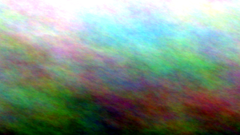

# Canvas

<p align="left">
  
  
  
  
  
</p>

<p align="left">
<a href="https://www.buymeacoffee.com/adi1090x"></a>
<a href="https://ko-fi.com/adi1090x"></a>
</p>

A `bash` script to generate and apply different types of **gradient** & **blured** wallpapers.


### Features

+ Generate a `solid color` wallpaper
+ Generate a `random blured` wallpaper
+ Generate linear, radial, bilinear(4 colored) & twisted `gradient` wallpapers
+ Generate random, twisted or colored `plasma` wallpapers


### Dependencies

+ `imagemagick`
+ `feh`
+ `xrandr` (only for xfce)

### Installation

+ Clone this repository...
```bash
cd $HOME
git clone https://github.com/adi1090x/canvas.git
cd canvas
chmod +x canvas
```

+ Run the program and choose an option
```bash
$ ./canvas -h

┏━╸┏━┓┏┓╻╻ ╻┏━┓┏━┓
┃  ┣━┫┃┗┫┃┏┛┣━┫┗━┓
┗━╸╹ ╹╹ ╹┗┛ ╹ ╹┗━┛

Canvas V1.0  : The Wallpaper Generator.
Developed By : Aditya Shakya (@adi1090x)
	
Usage : canvas [-h] [-S px] [-B] [-s] [-l] [-r] [-t] [-b] [-p]

Options:
   -h   --help		    Show this help message & exit
   -S   --size		    Size of the wallpaper (default is 1366x768)
   -B   --blured	    Generate a random blured wallpaper
   -s   --solid		    Generate a solid color wallpaper
   -l   --linear	    Generate a linear gradient wallpaper
   -r   --radial	    Generate a radial gradient wallpaper
   -t   --twisted	    Generate a twisted gradient wallpaper
   -b   --bilinear	  Generate a bilinear(4point) gradient wallpaper
   -p   --plasma	    Generate a plasma wallpaper
```

### Usage

Here's a [list](https://imagemagick.org/www/script/color.php) of all supported color names.

**1**. Generate random blured wallpaper...


```
$ canvas -B

Enter the blur strength (maximum 30): 14 

Set as desktop background? (y/n): y


```

**2**. Generate a solid color wallpaper...


```
$ canvas -s

Enter the color name or hex (eg: teal, #EBCB8B): #A3BE8C

Set as desktop background? (y/n): y


```

**3**. Generate a linear gradient wallpaper...


```
$ canvas -l

Enter the colors name or hex (format: color1-color2): orange-purple

Enter the rotation angle (default is 0): 45

Set as desktop background? (y/n): y
```

**4**. Generate a radial gradient wallpaper...


```
$ canvas -r

Enter the colors name or hex (format: color1-color2): cyan-#2E3440

Shape? (diagonal, ellipse, maximum, minimum): diagonal 

Enter the rotation angle (default is 0): 0
```

**5**. Generate a twisted gradient wallpaper...


```
$ canvas -t

Enter the colors name or hex (format: color1-color2): blue-pink

Enter the twisting amount (maximum 500): 180

Set as desktop background? (y/n): y
```

**6**. Generate a bilinear gradient wallpaper...


```
$ canvas -b

Enter first color (eg: red, #EC7875): cyan
Enter second color (eg: green, #61C766): SpringGreen
Enter third color (eg: yellow, #FDD835): orange
Enter fourth color (eg: blue, #42A5F5): IndianRed1
Smooth or Regular? (s/r): s
```

**7**. Generate a plasma wallpaper...



```
$ canvas -p

Random, Twisted or Custom colors? (r/t/c): r

Set as desktop background? (y/n): n


```

### Common Issues

1. **Wallpaper not changing** : If your wallpaper is not changing, then open an issue and show me the output of `echo $DESKTOP_SESSION`.

2. **Not working on XFCE** : If this script is not working on xfce, then open the terminal and run `xfconf-query -c xfce4-desktop -m` and change the wallpaper (any) via *xfce4-settings-manager*. <br />
In terminal, *xfconf-query* will print lines starting with `set:`, which show which properties have been changed, check `screen` & `monitor` values and modify the script accordingly.
```bash
91   ## For XFCE
92   if [[ "$OSTYPE" == "linux"* ]]; then
93   	   SCREEN="0"
94       MONITOR="1"
95   fi

```

### Support This Project
<p align="left">
<a href="https://www.paypal.me/adi1090x" target="_blank"></a>
<a href="https://www.buymeacoffee.com/adi1090x" target="_blank"></a>  
<a href="https://ko-fi.com/adi1090x" target="_blank"></a>  
</p>

### FYI

+ In KDE, it changes the wallpaper in all the Activities.
+ If you can improve it, you're welcome.
+ Have Fun!

